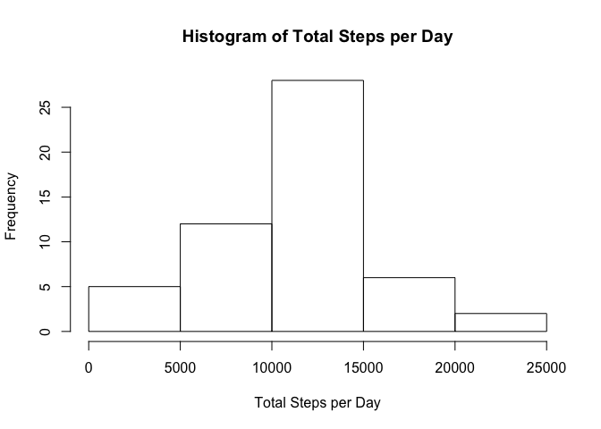
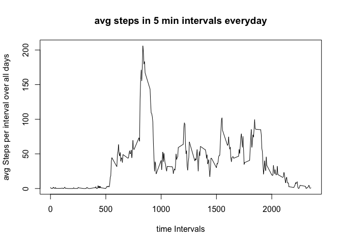
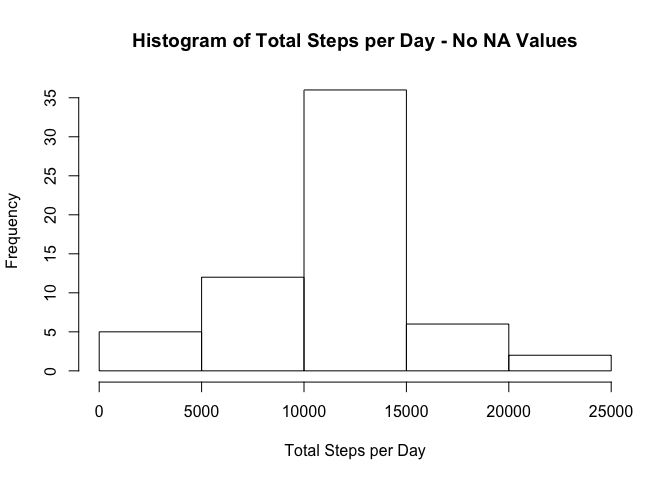
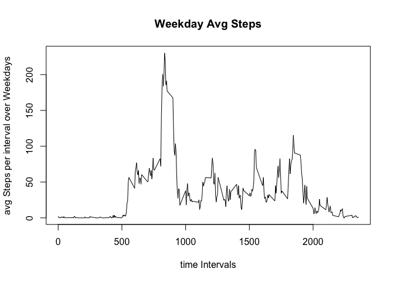
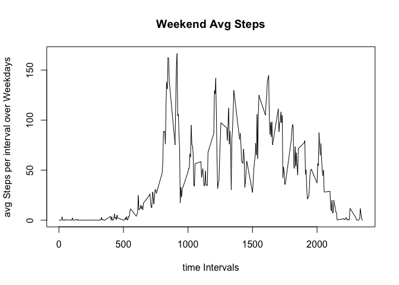

# assignment1
Misagh Naderi  
January 10, 2016  

This is an R Markdown document. Markdown is a simple formatting syntax for authoring HTML, PDF, and MS Word documents. For more details on using R Markdown see <http://rmarkdown.rstudio.com>.

When you click the **Knit** button a document will be generated that includes both content as well as the output of any embedded R code chunks within the document. You can embed an R code chunk like this:

Code for reading in the dataset and/or processing the data
Histogram of the total number of steps taken each day
Mean and median number of steps taken each day
Time series plot of the average number of steps taken
The 5-minute interval that, on average, contains the maximum number of steps
Code to describe and show a strategy for imputing missing data
Histogram of the total number of steps taken each day after missing values are imputed
Panel plot comparing the average number of steps taken per 5-minute interval across weekdays and weekends
All of the R code needed to reproduce the results (numbers, plots, etc.) in the report


```r
library(plyr)
hw1.df<- read.csv(file = '~/Documents/R-programming/assignments/activity.csv',header = TRUE)

#Calculate total steps per day
stepsdf<-ddply(hw1.df,.(date), summarise,sumsteps=sum(steps))
hist(stepsdf$sumsteps,xlab = 'Total Steps per Day', main = "Histogram of Total Steps per Day")
```

 

```r
mean.steps.per.day <-mean(stepsdf$sumsteps,na.rm = TRUE)
median.steps.per.day <-median(stepsdf$sumsteps,na.rm = TRUE)

message("mean.steps.per.day = ", mean.steps.per.day)
```

```
## mean.steps.per.day = 10766.1886792453
```

```r
message("median.steps.per.day = ", median.steps.per.day)
```

```
## median.steps.per.day = 10765
```

```r
#asidf contains  mean steps per each interval averaged over all days
asidf<-ddply(hw1.df,.(interval), summarise, avgsteps= mean(steps,na.rm = TRUE) )

 plot(asidf$interval,asidf$avgsteps,type="l",main='avg steps in 5 min intervals everyday',xlab='time Intervals',ylab="avg Steps per interval over all days")
```

 

```r
#Which 5-minute interval, on average across all the days in the dataset, contains the maximum number of steps?

 MaxStepInt <- asidf$interval[which.max(asidf$avgsteps)]
 message("Max Step Interval = ", MaxStepInt)
```

```
## Max Step Interval = 835
```

```r
 #Imputing missing values by replacing NAs in each interval with the Avg of that interval.
 NAcount <- sum(is.na(hw1.df$steps))
 message("NAcount = ", NAcount)
```

```
## NAcount = 2304
```

```r
  library(plyr)
impute.mean <- function(x) replace(x, is.na(x), mean(x, na.rm = TRUE))
newhw1df <- ddply(hw1.df, .(date), transform, steps = impute.mean(steps))
 
#replacing NA values in the original dataframe hw1.df with avgsteps per interval over days from asidf 

newData <- hw1.df
for (i in 1:nrow(newData)) {
    if (is.na(newData$steps[i])) {
        newData$steps[i] <- asidf$avgsteps[which(newData$interval[i] == asidf$interval)] 
    }
}

#total steps of the newData without any NA values
newstepsdf<-ddply(newData,.(date), summarise,sumsteps=sum(steps))
hist(newstepsdf$sumsteps,xlab = 'Total Steps per Day', main = "Histogram of Total Steps per Day - No NA Values")
```

 

```r
new.mean.steps.per.day <-mean(newstepsdf$sumsteps,na.rm = TRUE)
new.median.steps.per.day <-median(newstepsdf$sumsteps,na.rm = TRUE)

message("new.mean.steps.per.day = ", mean.steps.per.day)
```

```
## new.mean.steps.per.day = 10766.1886792453
```

```r
message("new.median.steps.per.day = ", median.steps.per.day)
```

```
## new.median.steps.per.day = 10765
```

Removing NA values changed the distributionn of the data in that the new median is now equal to the mean while it was a smaller value before showing that the original data was skewed towrds left, or smaller values. 

```
## 
## weekdays  weekend 
##    12960     4608
```

  

Note that the `echo = FALSE` parameter was added to the code chunk to prevent printing of the R code that generated the plot.
